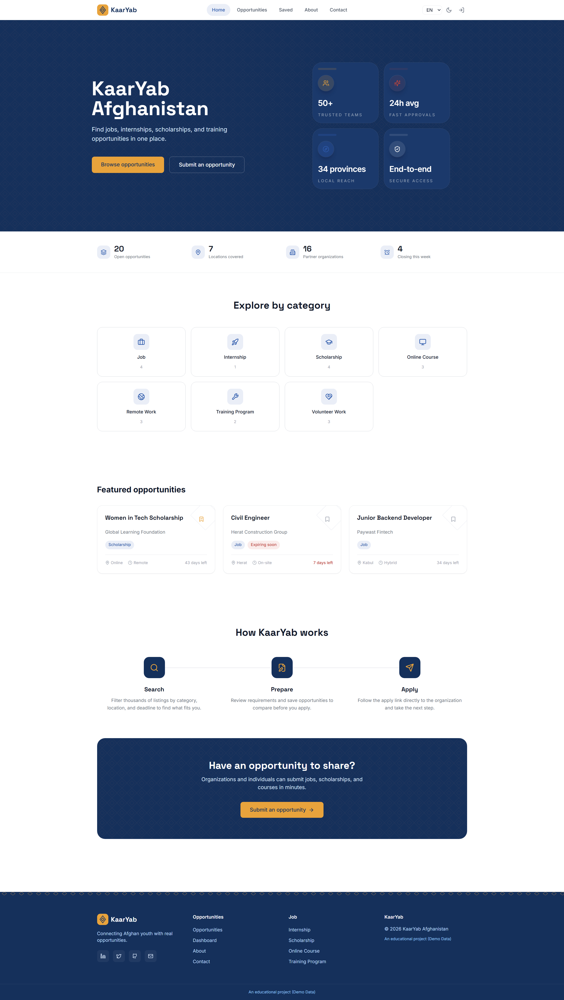
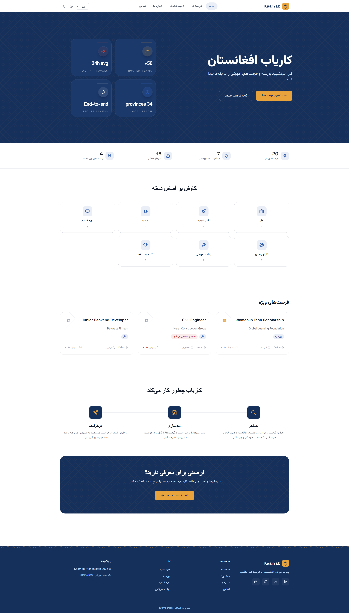
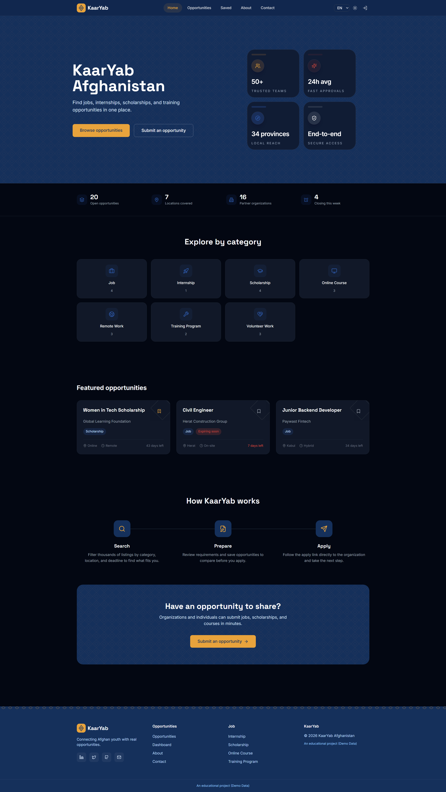
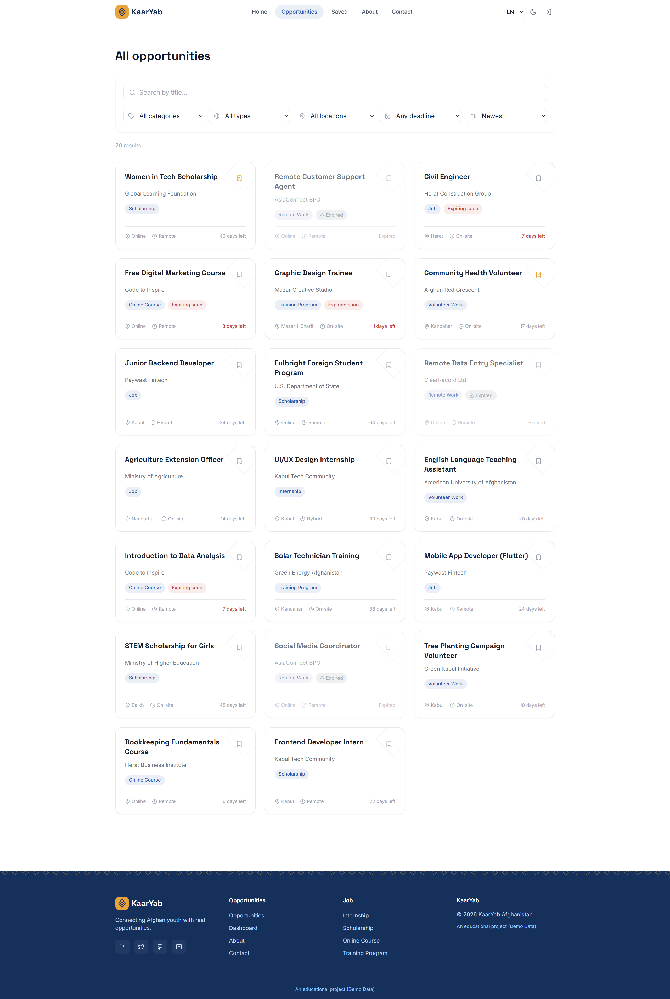
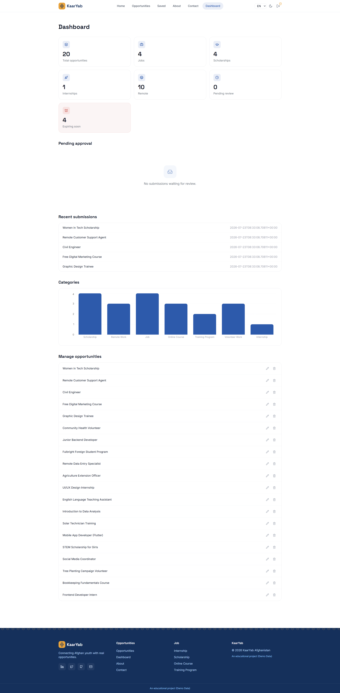
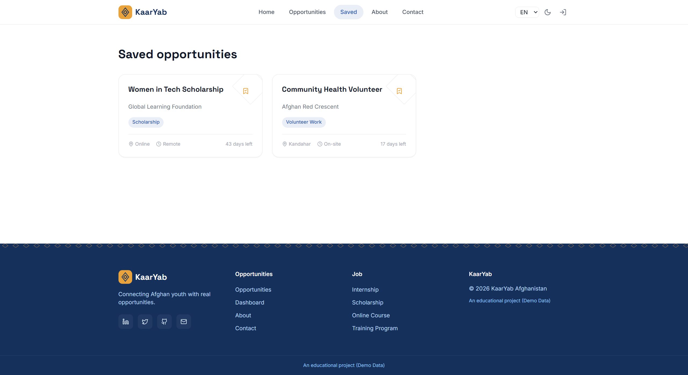
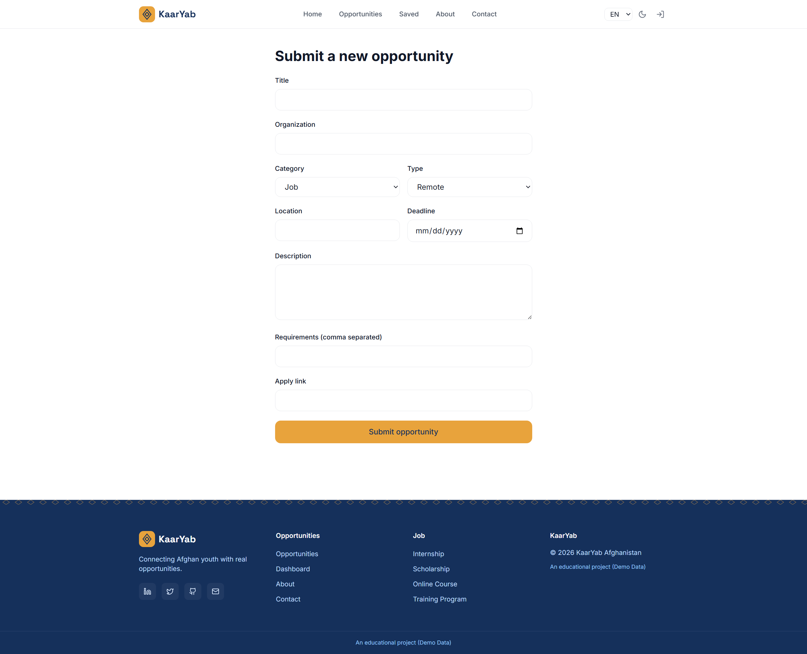
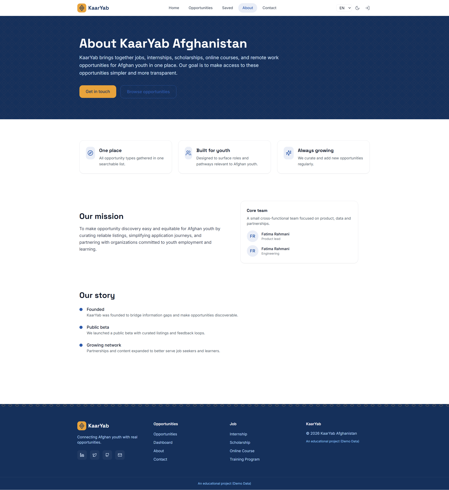
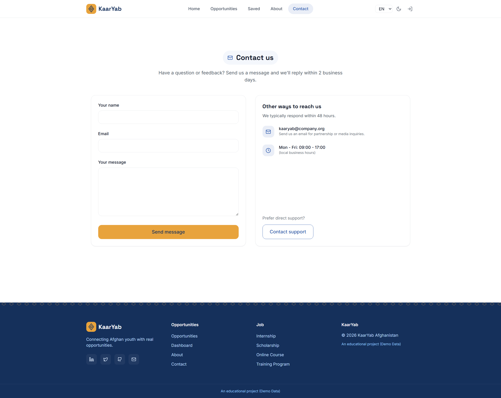

# KaarYab Afghanistan

A modern **trilingual opportunity-finder platform** that helps Afghan youth discover jobs, internships, scholarships, online courses, remote work, and training programs — all in one place.

Built with **Next.js 15 (App Router)**, **TypeScript**, **Supabase**, and **Tailwind CSS**.

> **Demo Data:** All opportunity listings in this project are for demonstration purposes only.

## Live Demo

🌐 https://kaaryab-gules.vercel.app/

## GitHub Repository

📂 https://github.com/Fatima-Rahmani79/Kaaryab

---

## Project Overview

Many young people in Afghanistan struggle to find reliable information about jobs, scholarships, internships, online work, and training opportunities because the information is scattered across multiple websites and social media platforms.

**KaarYab Afghanistan**

Problem It Solves:
Many young people in Afghanistan need better access to opportunities such as jobs,
internships, scholarships, online work, and training programs, but this information
is scattered across many different websites and social media pages. KaarYab solves
this by bringing everything into one clean, searchable, filterable platform where
people can browse, save, and submit opportunities.

---

# Features

## Opportunity Platform

- Browse jobs, internships, scholarships, remote work, online courses, volunteer work, and training programs
- Dynamic opportunity details page (`/opportunities/[id]`)
- Search opportunities by title
- Filter by:
  - Category
  - Location
  - Opportunity type
  - Deadline
- Save opportunities using LocalStorage
- Featured opportunities
- Deadline countdown
- Expiring Soon / Expired badges

---

## Authentication & Admin

- Supabase Authentication
- User registration & login
- Admin role
- Route protection
- API protection
- Admin approval workflow
- Full CRUD operations

Every submitted opportunity is created with a **Pending** status and remains hidden until an administrator approves it.

---

## Dashboard

The admin dashboard includes:

- Live statistics
- Category breakdown chart
- Pending approval queue
- Opportunity management table
- Edit/Delete actions

---

## User Experience

- Fully responsive design
- Mobile navigation
- Light & Dark mode
- Automatic system theme detection
- English, Dari & Pashto
- RTL support
- Framer Motion animations
- Loading skeletons
- Empty states
- Toast notifications
- Confirmation dialogs

---

# Architecture

- Next.js App Router
- Server Components for rendering
- Client Components for interactive UI
- Supabase Authentication
- PostgreSQL database
- REST API Routes
- Context API
- next-intl localization

---

## Technologies Used

- Next.js 15 (App Router)
- React 19
- TypeScript
- Supabase (Authentication + PostgreSQL)
- Tailwind CSS
- next-intl
- React Hook Form
- Zod
- Framer Motion
- Recharts

---

# Running Locally

## 1. Install dependencies

```bash
npm install
```

---

## 2. Create a Supabase project

Create a free Supabase project.

---

## 3. Run SQL files

Run these SQL files **in order**:

```
supabase/schema.sql
supabase/auth.sql
supabase/status_column.sql
```

---

## 4. Disable email confirmation

Authentication → Providers → Email

Turn **Confirm Email** OFF.

---

## 5. Configure environment variables

Copy

```
.env.local.example
```

to

```
.env.local
```

and fill in

```
NEXT_PUBLIC_SUPABASE_URL
NEXT_PUBLIC_SUPABASE_ANON_KEY
```

---

## 6. Seed the database

```bash
node --env-file=.env.local scripts/migrate-to-supabase.mjs
```

---

## 7. Start the project

```bash
npm run dev
```

---

## 8. Make your account an admin

Run:

```sql
alter table profiles disable row level security;

update profiles
set is_admin = true
where email = 'your-email@example.com';

alter table profiles enable row level security;
```

---

## 9. Deploy to Vercel

Add the same environment variables in

Project Settings → Environment Variables

---

# Demo Admin Account

For grading purposes, an administrator account is provided.

```
Email:
admin@gmail.com

Password:
asop12
```

Login:

```
/login
```

---

# Screenshots

## Home



## Home (Translated)



## Dark Mode



## Opportunities



## Dashboard



## Saved Opportunities



## Submit Opportunity



## About



## Contact



---

# Future Improvements

- Strengthen Row Level Security (RLS) policies
- PDF CV Builder
- Email delivery for the contact form
- User profile management
- Opportunity analytics

---

# Known Limitations

- Admin assignment currently requires one SQL query because of the project's RLS policies.
- Supabase Free Tier limits outgoing email, so email confirmation is disabled.

---

# Project Structure

```text
middleware.ts

i18n.ts

messages/
    en.json
    fa.json
    ps.json

supabase/
scripts/
app/
components/
context/
lib/
types/
data/
```

---

# Translation

When adding a new translation key, add it to all three files:

```
messages/en.json
messages/fa.json
messages/ps.json
```

Missing keys will cause runtime errors.
